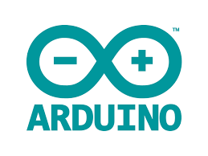

# Arduino_Projects
Arduino projects.

This file includes the following projects:-
## Automated Dustbin

## Automated Handwash

## LED cube blinking pattern

## line following bot code

### Tools and Languages Used:

 

### Steps to follow
-Install arduino ide to run these codes 
-Download the code from the given github repository 
-Run the code in arduino ide  

### Developed by:
<a href="https://github.com/sambit221">Sambit Kumar Tripathy</a>